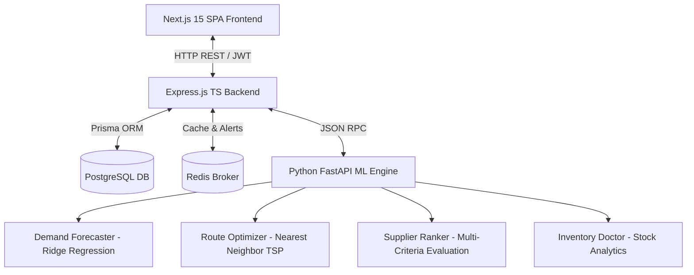

# SupplyChainX – Autonomous AI-Powered Supply Chain Intelligence Platform

SupplyChainX is a production-ready enterprise-grade logistics and inventory orchestration system. It integrates Node.js (Express & TypeScript) backend microservices, a Python FastAPI AI engine, and a Next.js 15 Tailwind UI client to build a fully automated command center.

---

## Technical Architecture Overview



### Stack Details
- **Frontend**: Next.js 15, React, Recharts (Dynamic charts), Lucide (Icons), Tailwind CSS (Premium Dark theme styling).
- **Backend**: Node.js, Express, TypeScript, Prisma ORM (Type-safe SQL).
- **AI/ML Service**: Python 3.10, FastAPI, Pandas, NumPy, Scikit-learn (Ridge regression).
- **Data Layers**: PostgreSQL (Persisted data), Redis (Cache & mock pub/sub events broker).
- **Infrastructure**: Docker, Docker Compose.

---

## Directory Structure

```
SupplyChainX/
├── backend/            # Express.js server & Prisma models
│   ├── prisma/         # Database schemas and seed data
│   ├── src/            # Controllers, middleware, routes
│   └── Dockerfile      # Backend container instructions
├── frontend/           # Next.js SPA client UI
│   ├── src/            # Responsive views and api layers
│   └── Dockerfile      # Frontend container instructions
├── ai_service/         # FastAPI ML analytics server
│   ├── models/         # Scikit-learn demand, route, risk engines
│   └── Dockerfile      # Python container instructions
├── docker-compose.yml  # Container orchestration script
└── .env                # Global configuration properties
```

---

## Core Feature Modules

1. **User Management**: Session login gateway with Role-Based Access Control (Admin, Manager, Warehouse Manager, Supplier, Analyst).
2. **Inventory Doctor**: Automatic diagnostics classifying stocks into Overstock, Understock, Dead stock, and Slow-moving components. Calculates monthly holding losses.
3. **AI Demand Forecasting**: Seasonal analysis predicting demand levels 7 to 90 days out, reporting trend coefficients and peak days.
4. **Supplier Intelligence**: Multi-criteria supplier ranker evaluating lead speed, reliability ratings, unit costs, and defect ratios.
5. **Risk Radar**: Real-time warning center highlighting logistics delays, stock depletion warnings, and demand spikes.
6. **Logistics Route Optimization**: Nearest-Neighbor Traveling Salesperson pathing calculating distance, fuel bills, transit times, and carbon outputs.
7. **Digital Twin Simulator**: Dynamic stress simulator evaluating events like supplier defaults, demand surges (+200%), and facility closures.
8. **Traceability**: Dynamic QR journey log tracking serial codes across Supplier → Factory → Warehouse → Distributor → Customer.
9. **Green Supply Chain**: Carbon and fuel consumption trackers highlighting emission trends and eco-ratings of suppliers.
10. **Report Exporter**: On-demand generator compiling structured CSV, PDF, and Excel documents.
